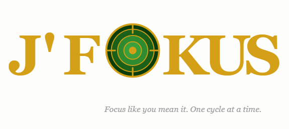

# J'Fokus | Sustainable Automated Focus Timer

  

## What is J'Fokus?

J'Fokus is a personal sustainable automated Pomodoro timer built to solve a simple problem:
existing Pomodoro apps don't let you fully customize and automate your entire focus day in a way that respects your energy long term.

## The idea

A fully automated daily focus cycle that runs itself. No manual restarting, no guessing when to break. Just focus.

And the best part? You set it up your way. You define the rhythm that works for you then let it run. Automated but never out of your hands.

## My cycle

- 25 min focus
- 7 min short break
- After every 3 cycles: 21 min long break
- Runs daily: 7AM to 7PM

## Why not existing apps?

- Most Pomodoro apps require manual restart after each session
- None let you schedule a full day from start time to end time automatically
- No app matched exactly the cycle rhythm I needed
- None were built with sustainable energy in mind just maximum output

## Functional flow (v0.1)

1. Timer starts at configured start time (default 7AM)
2. 25min focus session begins
3. Short break (7min) triggered automatically
4. After 3 cycles: long break (21min) triggered automatically
5. Cycle repeats until end time (default 7PM)
6. Optional: sound/notification alerts at each transition

## Principles

- fully automated once configured
- you stay in control of the cycle setup
- customizable rhythm that fits your real day
- distraction-free design
- built for sustainable human energy... not hustle mode

## Sound and music

J'Fokus supports audio for both focus sessions and transitions. Two options planned:

**Option 1: Local audio files (v0.1)**
- Play background sound or music during focus sessions
- Audio alerts at each transition (break start, focus start, long break)
- Default options included out of the box
- Add your own files anytime by dropping them in the `/sounds` folder
- Works offline, no setup needed

**Option 2: Spotify integration (v0.2)**
- Trigger a playlist or track from your Spotify library during focus or break
- Requires an active Spotify account and Spotify installed on your device
- First time setup: a quick one-time login to connect your Spotify to J'Fokus

## Current stage

- concept definition
- initial documentation
- Python prototype in progress

## Next steps

- build basic timer logic in Python
- add sound/desktop notifications
- add start/end time configuration
- explore simple UI or CLI interface

## Vision

A focus tool that works the way your brain actually works. Not max output. Sustainable output.

## Philosophy

J'Fokus is not about doing every session perfectly.
It's about showing up to the next one.

The cycle runs. You follow when you can. You rest when you need to.
The timer doesn't judge. It just waits for you.

And on the days you do follow it fully? You might surprise yourself.
No planning, no motivating, no guessing what's next.
Just cycle after cycle quietly adding up.

Consistency > perfection. Every time.

## Personal note

J'Fokus was born from frustration and from learning the hard way that productivity without rhythm leads to burnout.
I couldn't find a Pomodoro app that automated my exact rhythm and still let me stay in control of it.
So I decided to build it myself.

Not to do more. To do better. Sustainably.

*J = Je focus. Jazda fokus. Jacky fokus.*

---

## About JLabs

J'Fokus is part of **JLabs (j-labo)** — my personal lab where real-life 
problems become tools:

- [ARC](https://github.com/jacky-labs-26/arc-anonymous-return-channel) | anonymous callback channel for masked numbers
- [Kinga](https://github.com/jacky-labs-26/kinga-ethical-blocker) | smart blocker for unsolicited calls
- [i-SAFE](https://github.com/jacky-labs-26/i-safe) | universal, accessible backup
- [RED Ping](https://github.com/jacky-labs-26/red-ping) | mission location for humanitarian volunteers

→ [Explore all JLabs projects](https://github.com/jacky-labs-26)
